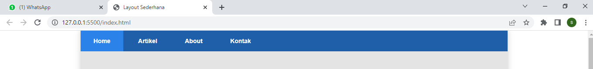
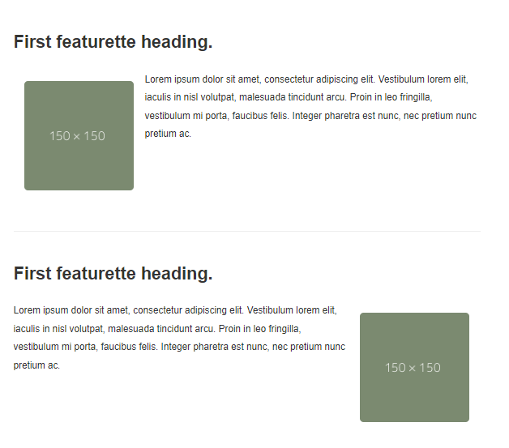
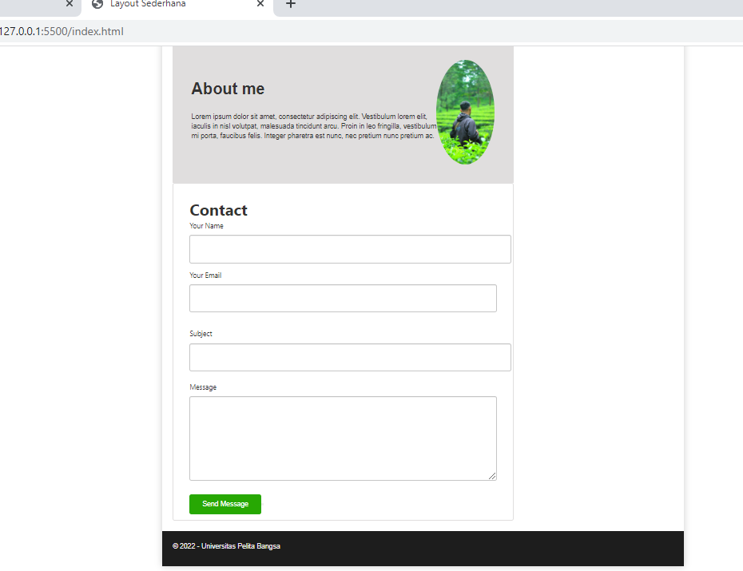

# Nama: Sardin
# Kelas: TI.20.A1
# Nim: 312010135


 ## Layout sederhana Menggunakan Bootstrap Framewok

- ## Lankah-Langkah membuat layout sederhana menggunakan bootstrap framework

### 1. Membuat Documet HTML

Pertama Saya disini membuat dokumen html

```Html
<!DOCTYPE html>
<html lang="en">
  <head>
    <meta charset="UTF-8" />
    <meta http-equiv="X-UA-Compatible" content="IE=edge" />
    <meta name="viewport" content="width=device-width, initial-scale=1.0" />
    <title>Bootstrap Framework</title>
  </head>
  <body></body>
```

### 2. Getstart

Bootstrap framework, boostrap sendiri merupakan website open source yang didalam nya terdapat file css,js berikut file yang saya gunakan

```Html
<head>
    <!-- GETSTART Bootstrap css framework -->
   <link rel="stylesheet" href="asset/bootstrap/css/bootstrap-responsive.css">
    <link rel="stylesheet" href="asset/bootstrap/css/bootstrap-responsive.min.css">
    <link rel="stylesheet" href="asset/bootstrap/css/bootstrap.css">
    <link rel="stylesheet" href="asset/bootstrap/css/bootstrap.min.css">
    <!-- End Bootstrap css framework -->
</head>
<!-- LAYOUT SEDERHANA BOOTSTRAP FRAMEWORK -->
<body>

    <!-- GETSTART Bootstrap js framework -->
    <script src="asset/bootstrap/js/bootstrap.js"></script>
    <script src="asset/bootstrap/js/bootstrap.min.js"></script>
        <!-- End Bootstrap js framework -->
</body>

</html>
```

### 3. NavBar



```Html
 <nav>
            <a href="home.html" class="active">Home</a>
            <a href="artikel.html">Artikel</a>
            <a href="about.html">About</a>
            <a href="kontak.html">Kontak</a>
        </nav>
```

### 4. Hero Selection


```Html
<section id="hero">
            <h1>HELLO WORLD</h1>
            <p>Lorem ipsum dolor sit amet, consectetur adipiscing elit. Vestibulum lorem
                elit, iaculis innisl volutpat, malesuada tincidunt arcu. Proin in leo fringilla,
                vestibulum mi porta, faucibus felis. Integer pharetra est nunc, nec pretium nunc
                pretium ac.</p>
            <a href="home.html" class="btn btn-large">Learn more &raquo;</a>
        </section>
```

### 4. Cards

Saya menggunakan cards, Untuk membuat body konten.


```Html
<section id="wrapper">
  <section id="main">
    <div class="row">
      <div class="box">
        
        <h3>Heading</h3>
        <p>
          Donec sed odio dui. Etiam porta sem malesuada magna mollis euismod.
        </p>
        <a href="#" class="btn btn-default">View detail</a>
      </div>
      <div class="box">
        
        <h3>Heading</h3>
        <p>
          Donec sed odio dui. Etiam porta sem malesuada magna mollis euismod.
        </p>
        <a href="#" class="btn btn-default">View detail</a>
      </div>
      <div class="box">
        
        <h3>Heading</h3>
        <p>
          Donec sed odio dui. Etiam porta sem malesuada magna mollis euismod.
        </p>
        <a href="#" class="btn btn-default">View detail</a>
      </div>
    </div>
  </section>
</section>
```

### 6. List Group


```Html
<aside id="sidebar">
                <div class="widget-box">
                    <h3 class="title">Widget Header</h3>
                    <ul>
                        <li><a href="#">Widget Link</a></li>
                        <li><a href="#">Widget Link</a></li>
                        <li><a href="#">Widget Link</a></li>
                        <li><a href="#">Widget Link</a></li>
                        <li><a href="#">Widget Link</a></li>
                    </ul>
                </div>
                <div class="widget-box">
                    <h3 class="title">Widget Text</h3>
                    <p>Vestibulum lorem elit, iaculis in nisl volutpat, malesuada tincidunt
                        arcu. Proin in leo fringilla, vestibulum mi porta, faucibus felis. Integer
                        pharetra est nunc, nec pretium nunc pretium ac.</p>
                </div>
            </aside>
```

### 7. Article



```Html
 <div>
                        <hr class="divider" />
                        <article class="entry">
                            <h2>First featurette heading.</h2>
                            
                            <p>Lorem ipsum dolor sit amet, consectetur adipiscing elit. Vestibulum lorem
                                elit, iaculis in nisl volutpat, malesuada tincidunt arcu. Proin in leo fringilla,
                                vestibulum mi porta, faucibus felis. Integer pharetra est nunc, nec pretium nunc
                                pretium ac.</p>
                        </article>
                        <hr class="divider" />
                        <article class="entry">
                            <h2>First featurette heading.</h2>
                            
                            <p>Lorem ipsum dolor sit amet, consectetur adipiscing elit. Vestibulum lorem
                                elit, iaculis in nisl volutpat, malesuada tincidunt arcu. Proin in leo fringilla,
                                vestibulum mi porta, faucibus felis. Integer pharetra est nunc, nec pretium nunc
                                pretium ac.</p>
                        </article>
                        <hr class="divider">
                    </div>
```

### 8. Footer



```Html
<div>
                                
                            </div>
                        </div>

                        <div class="kontak-body">
                            <h1>Contact</h1>
                            <form class="kontak-form-class">
                                <div class="form-form-group">
                                    <label for="name" class="kontak-label">Your Name</label>
                                    <input type="text" id="name" name="name" class="kontak-form-control" required>
                                </div>

                                <div class="kontak-form-group">
                                    <label for="name" class="kontak-label">Your Email</label>
                                    <div class="kontak-input-group">
                                        <input type="email" id="email" name="name" class="kontak-form-control" required>
                                    </div>
                                </div>
                            </form>
                            <div class="kontak-form-group">
                                <label for="name" class="kontak-label">Subject</label>
                                <input type="text" id="name" name="name" class="kontak-form-control" required>
                            </div>
                            <div class="kontak-form-group">
                                <label for="name" class="kontak-label">Message</label>
                                <div class="kontak-input-group">
                                    <textarea id="message" name="message" class="kontak-form-control" rows="6"
                                        maxlength="3000" required></textarea>
                                </div>
                            </div>
                            <div class="kontak-form-group">
                                <div class="loading">
                                    Loading
                                </div>
                                <div class="error-message">
                                </div>
                                <div class="sent-message">Your message has been sent. Thank you!
                                </div>
                            </div>
                            <div class="text-center">
                                <button type="submit">Send Message
                                    <button>
                            </div>
                        </div>
```
